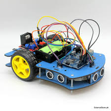
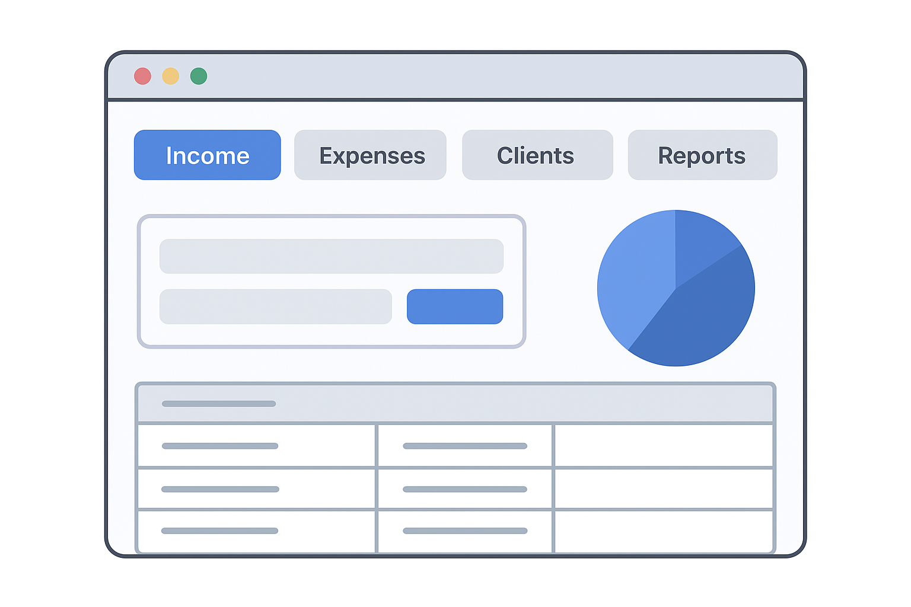

## Finhub Blockchain Hackathon Winner (2023)
**Role:** Fullstack Web Developer + Product Strategist  
- Part of a 4-person team that won first place at the **Finhub Blockchain Hackathon**.  
- Developed a blockchain-related web application.  
- **Tech stack:** Frontend: ReactJS + JavaScript, Backend: Python + FastAPI  

{: style="width:300px;" }

---

## Maze-Solving Robot (2024)
**Role:** Embedded Systems Developer  
- Built a robot vehicle that autonomously navigates a maze using an STM32 board.  
- Implemented a **line-following algorithm** + **modified Dijkstra's algorithm**.  

{: style="width:300px;" }

---

## Accounting Desktop Application (2021)
**Role:** Software Developer  
- Developed a Python desktop app using **Tkinter** to manage small business accounting.  

{: style="width:300px;" }

